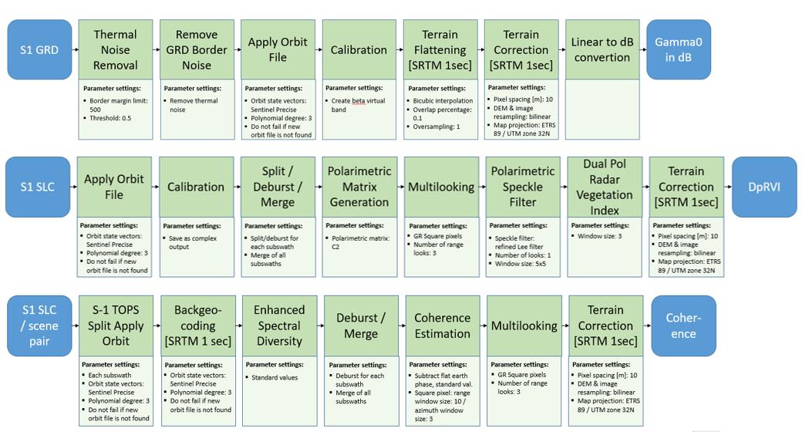
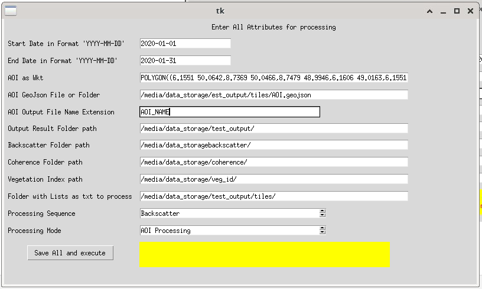
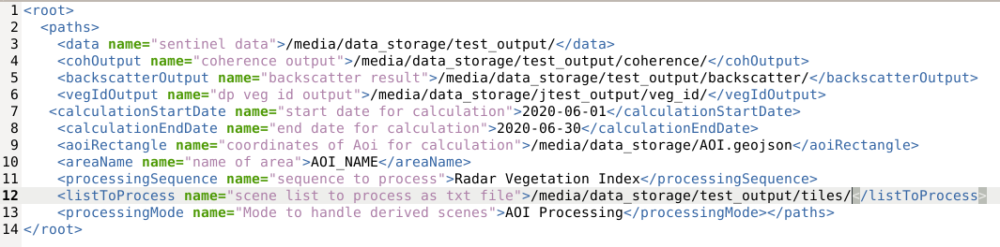

### Author and Contributors
[Jennifer McClelland](https://gitea.julius-kuehn.de/Jennifer.McClelland),
[Karlmarx Thangamani](https://gitea.julius-kuehn.de/Karlmarx.Thangamani),
[Tanja Riedel](https://gitea.julius-kuehn.de/Tanja.Riedel),
[Florian Beyer](https://gitea.julius-kuehn.de/Florin.Beyer), Date 2023-08-04, Version 1.0 beta

# Processing Sentinel-1 SAR data to ARD

The App automates the processing of Sentinel-1 SAR data timeseries to ARD (analysis-ready data) products.
The processing uses the PyroSar Python library for multiprocessing access of the graph processing tool (GPT) from the SNAP Sentinel-1 toolbox.

Following ARD products can be generated:

1. Radiometrically terrain corrected (RTC) backscatter on original GRD normalised GAMMA.
2. Radar Dual Pol Covariance based Vegetation Index and Radar Compact Pol Covariance based Vegetation Index on SLC data.
3. The Interferometric coherence on SLC data.

## Motivation

This App was created in the scope of the project NaLamKI meant to support sustainable agriculture. The aim is e.g. the retrieval of biophysical parameters of the crops like 
Biomass, Leaf Area Index and Phenology with Sentinel-1 SAR satellite sensors using Artificial intelligence technique.

## Prerequisites

The App will run best on a Code-De VM machine provided by Code-De, thus offering sufficient computational power and direct access to the GRD and SLC Sentinel-1 Level-1 IW Mode Data.
Code-De VM can be applied for here: https://code-de.org/en/news/virtual-machines/.

### Our System

Code-DE VM: Linux km-vm 5.4.0-90-generic, 101-Ubuntu, x86_64, GNU/Linux, CPU 2299.682 MHz, 16 CPU(s), 256 MiB L3 cache 

### Installations

Application of following tools and libraries:

- Snap Sentinel-1 Toolsboxes 9.0.0 (https://step.esa.int/main/download/snap-download/, https://senbox.atlassian.net/wiki/spaces/SNAP/pages/70503005/Installation+and+Configuration)
- Conda 4.13.0 (https://anaconda.org/Terradue/snap)
- Python version: 3.9.10
- Jupyterlab: 3.2.9
- PyroSAR: 0.12.1 (https://pyrosar.readthedocs.io/en/v0.12/general/installation.html)
- Optionally remote desktop tool X2Go (https://wiki.x2go.org/doku.php/download:start)

All Python Packages and tools were installed in a anaconda environment variable.
This environment can be recreated via the "env_basic.txt" file or installed manually. The main applied packages are: sentinelsat, shapely, geojson, lxml, geopandas, numpy and for use of the Gui ktinker and threading

Terminal commands for installations:
- "sudo sh 'path to installation file'/esa-snap_all_unix_9_0.sh -c"
- "sudo bash Anaconda3-2021.11-Linux-x86_64.sh"
- "conda create --name 'env' --file env_basic.txt" 
or
- "conda create -n ENV_NAME -c conda-forge python=3.9"
and manual installations via 
- "conda activate ENV_NAME"
- "conda install -c conda-forge 'package name and version'"
- "conda install -c conda-forge jupyterlab"

Jupyter Lab is accessed over browser via the Code-De VM IP e.g.:
- "jupyter lab --no-browser --ip=10.0.0.XXX --port=8890"

## Features

- This App offers the possiblity to calculate any of the mentioned products for any given timerange and any given area of interest on all aquired Sentinel-1 SAR data worldwide.
  Limitation of AOI polygon is the use of a rectangle. Notice: The output is always oriented towards the direction of the scene processed on.
  The Snap processing internally works in WGS84 unit until the finall output is created in EPSG:25832.

- The App offers three interfacing possibilities.
    1. Over the jupyter notebook "sentinel_sar_data_processing.ipnb"
    2. Directly over any terminal with ssh ip access and execution of the sentinel_sar_data_processing.py executable via "python3 sentinel_sar_data_processing.py".
       Ensure here the conda environment ist activated beforehand via "conda activate env_basic".
    3. Over the simple gui interface using the option --withGui via "python3 sentinel_sar_data_processing.py --withGui" (This option is only for when working with X2Go).

- On first execution via 2. or 3. a file named "user_settings.xml" will be created outside of the repository folder in .xml format.
  Here all variables for execution must be set including paths for calculation output and area of interest.
  The variables can either be set in the "user_settings.xml" file directly or over the gui.

- Possible processing sequences selectable are: Backscatter, Radar Vegetation Index, Coherence and All.
- The AOI can be set either as path to geojson file, coordinates in wkt or path to folder containing multiple AOI files.
  If AOI is given in wkt a geojson file will be created and saved on execution.
- A folder to contain logfiles and a list of non processed scenes will be created in the main given "Output Result Folder Path". A logfile for each processing sequence will be created and added to the folder. The file to contain the list of all error prone Scenes will be filled during runtime. This file can be reused to attempt to reprocess the list of scenes at a later stage.
- A folder to contain temporary calculations "temp" will be created in the main given "Output Result Folder Path". This content will be deleted after each processing sequence.
- "The AOI Output File Name extension" entry is extended to the name of each output product. Here the name of the AOI used to create the product can be extended.
- "Folder with Lists as txt to process" offers the option to enter a path to a folder containing a precreated .txt file containing a list of scenes. Depending on the file name ending (backscatter, coherence, veg_id or polarimetry) this file will be selected for the respective processing sequence.
- Diverse parameters are automatically set during calculation in the snap graph operator .xml files contained in the snap_graph_files folder. Most parameters are hardset in the files.
  The hardset parameters can be changed in the xml files if desired. E.g. the multilook variable as well as the selected polarizations.
- Diverse error handling to mal data is applied. Not all possible errors are handled (maybe in further versions).
- There are two processing Modes:
    1. "AOI Processing" is for small AOIs. In this mode the processing result overlaps the AOI in each orbit. Limitation of AOI in AOI Mode is a size of maximally 200km in height. This mode is optimal for smaller AOIs since reducing the datasize at an early stage speeds up processing time enormously.
    2. "Scene Processing" is for AOIs of any size. In this mode all scenes contained by the AOI are processed completely. The AOI subset is only applied to the border scenes to limit the final output to the AOI surface.

